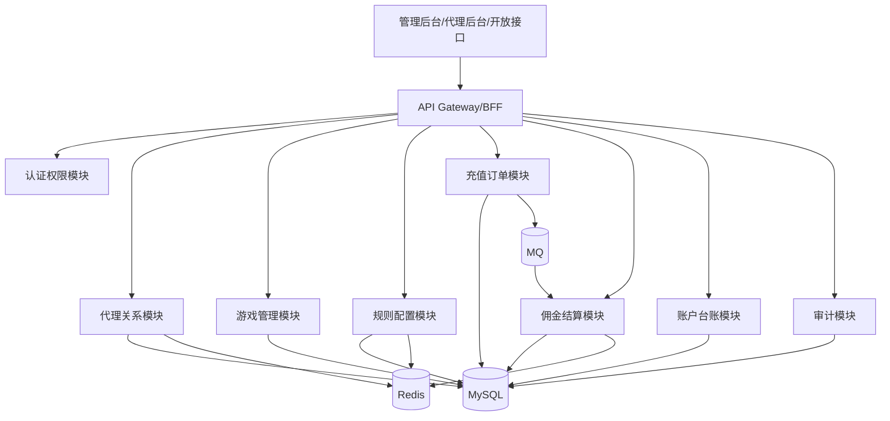
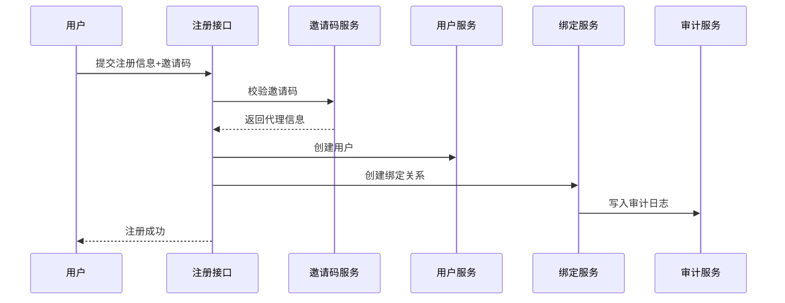
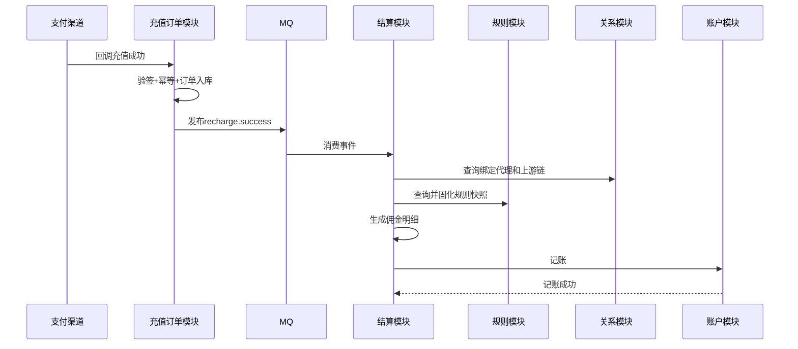
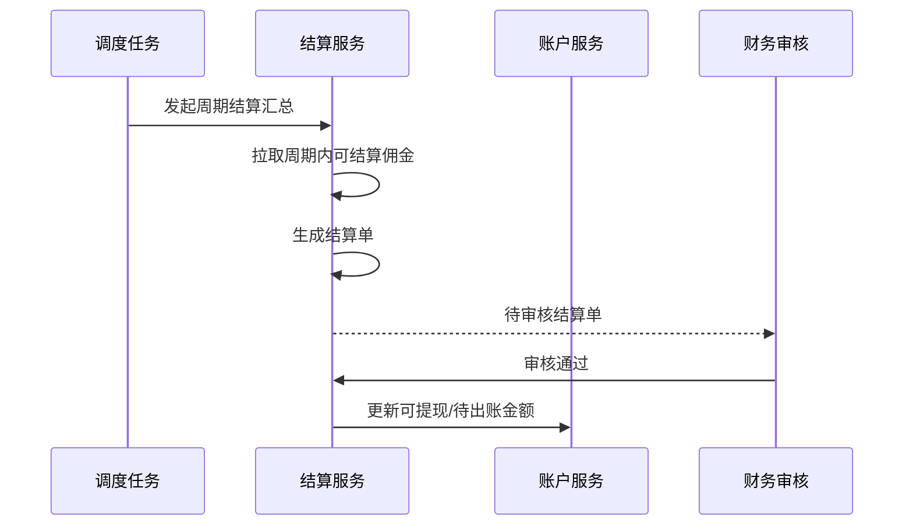
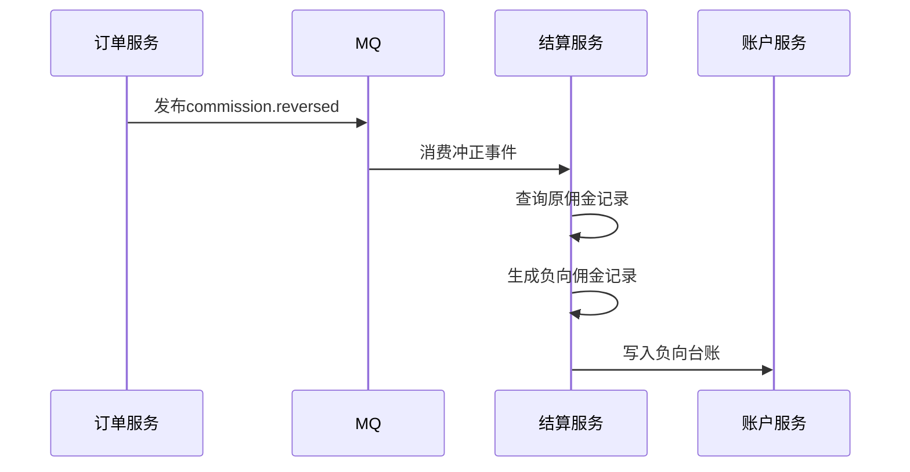
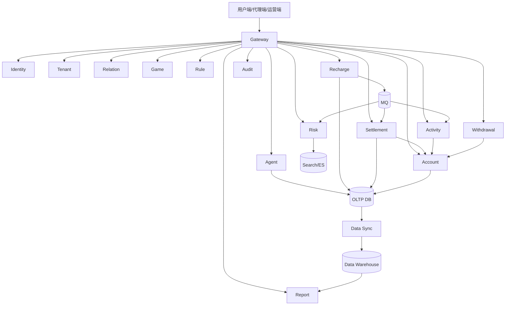

# 游戏代理管理系统分阶段需求文档与详细设计

> 基于《游戏代理管理系统框架设计方案》整理，按“三个阶段落地建议”输出可执行的需求文档与系统详细设计，便于产品、研发、测试、架构、运维和运营团队协同落地。

## 1. 文档目标

本文档围绕原方案中的三个阶段落地建议，分别给出：
- 阶段建设目标
- 范围定义（In Scope / Out of Scope）
- 角色与业务流程
- 功能需求
- 非功能需求
- 数据与接口要求
- 技术架构与模块设计
- 数据模型设计
- 核心时序与状态机
- 风险与验收标准

本文档默认继承原方案中的以下核心设计原则：
- 用户默认采用“全平台单一归属”
- 代理关系支持无限层级保存
- 佣金结算按规则限制参与层数
- 规则命中采用“逐层独立命中规则”
- 规则优先级为：代理-游戏专属 > 代理默认 > 游戏默认 > 平台默认
- 历史结算依赖快照，不依赖实时关系与实时规则
- 账务系统采用追加记账，不覆盖历史

---

## 2. 总体分阶段建设策略

### 2.1 分阶段原则

系统建设遵循“先跑通主链路，再增强能力，最后平台化”的原则：

1. 第一阶段优先打通业务闭环：
   代理注册/审核 -> 邀请码绑定 -> 用户注册 -> 充值入账 -> 佣金计算 -> 台账记账 -> 后台审计。

2. 第二阶段优先增强可运营性与可治理性：
   优化无限层级网络查询、丰富规则能力、增加周期结算、风控、报表、冲正与重算。

3. 第三阶段优先建设平台化和规模化能力：
   支持多租户/多品牌、活动奖励中心、提现财务系统、数据中台、智能风控。

### 2.2 技术演进策略

- 第一阶段：模块化单体 + Redis + MQ + 定时任务
- 第二阶段：模块化单体或按热点域拆分服务
- 第三阶段：按业务域微服务化，并引入统一数据与风控中台能力

### 2.3 统一设计约束

所有阶段都必须遵守以下约束：
- 充值订单是源事实，不允许直接修改原始成功订单
- 佣金、台账、结算单均采用追加式记录
- 高风险配置变更必须有审计日志
- 代理关系调整不得污染历史结算
- 任一结算过程都必须支持幂等
- 任一阶段都要预留 future-proof 扩展字段与接口版本能力

---

# 第一阶段：最小可用版本（MVP）

## 3. 第一阶段建设定位

### 3.1 阶段目标

第一阶段目标是在尽量短周期内完成核心业务闭环，支持代理管理、邀请码注册绑定、游戏管理、充值订单接入、有限层结算、基础台账、权限与审计，确保业务可以上线运行并具备基础可追溯能力。

### 3.2 阶段成功标准

第一阶段上线后，业务方应可以完成以下闭环：
- 创建代理并审核启用
- 代理生成邀请码并邀请用户注册
- 用户绑定代理归属并完成注册
- 用户发生充值后成功生成充值订单
- 系统根据用户归属和规则完成前 N 层佣金计算
- 系统为代理生成佣金明细与账户台账流水
- 运营后台可以查看代理、游戏、订单、佣金、台账、审计日志

### 3.3 In Scope

包含：
- 代理管理
- 邀请码管理
- 用户注册绑定代理
- 代理邀请代理的基础申请与审核能力
- 游戏管理
- 基础代理可代理游戏授权
- 基础佣金规则管理
- 充值订单接入
- 有限结算层数佣金计算
- 规则快照
- 基础代理账户与台账
- 基础 RBAC 与审计日志

### 3.4 Out of Scope

暂不包含：
- 闭包表高性能查询
- 复杂差额分润/见点分润/封顶分润
- 周期结算单
- 大规模报表中心
- 智能风控
- 提现系统
- 多租户/多品牌
- 活动奖励中心

---

## 4. 第一阶段需求文档

### 4.1 角色定义

1. 超级管理员
   - 拥有所有配置、审核、发布权限
2. 运营管理员
   - 管理代理、游戏、规则和基础查询
3. 代理审核员
   - 审核代理申请
4. 财务查看人员
   - 查看佣金明细、账户台账
5. 审计查看人员
   - 查看关键操作日志
6. 代理后台用户
   - 查看自身邀请码、下级、佣金、台账
7. 普通玩家
   - 注册、绑定邀请码、充值

### 4.2 业务规则

1. 用户首次注册时允许填写邀请码并完成绑定。
2. 用户归属默认为平台级归属，不区分游戏归属。
3. 用户完成首次绑定后，第一阶段不支持自由改绑。
4. 代理关系底层按无限层级结构建模，但第一阶段佣金结算仅支持最多 N 层。
5. N 为规则配置项，由平台默认规则或代理/游戏规则决定。
6. 同一订单只能被成功结算一次。
7. 结算使用订单发生时命中的规则快照，不受后续规则变更影响。
8. 充值成功后佣金可进入“已计算”或“冻结中”状态，第一阶段可默认直接进入“可结算/已入账”简化模式。
9. 台账以追加流水方式记录收入与冲正，不允许覆盖历史流水。

### 4.3 功能需求

#### 4.3.1 代理管理

功能点：
- 新建代理
- 编辑代理资料
- 审核代理申请
- 启用/冻结/停用代理
- 查询代理列表与详情
- 为代理配置结算账户信息

核心字段：
- agent_id
- agent_code
- agent_name
- status
- direct_parent_agent_id
- settlement_account_no
- settlement_account_name
- tags
- created_at
- updated_at

验收要求：
- 冻结代理不能生成新邀请码
- 停用代理不能参与新增拉新与代理发展
- 已存在下级或已产生账务数据的代理不得物理删除

#### 4.3.2 邀请码管理

功能点：
- 生成主邀请码
- 生成附属邀请码
- 设置邀请码有效期
- 设置邀请码状态：待启用、启用、失效、禁用
- 查询邀请码使用次数

业务规则：
- 每个代理必须有且仅有一个主邀请码
- 同一时刻可有多个附属邀请码
- 邀请码必须映射唯一代理主体
- 邀请码可限制渠道范围和游戏范围，但第一阶段可先保留字段，按全局有效执行

#### 4.3.3 用户注册绑定

功能点：
- 用户注册时输入邀请码
- 校验邀请码有效性
- 创建用户账户
- 写入用户绑定关系
- 写入绑定历史
- 记录邀请事件日志

校验项：
- 邀请码存在
- 邀请码在有效期内
- 邀请码状态有效
- 代理状态为启用
- 用户未注册或未绑定

异常处理：
- 邀请码无效时，注册失败并返回明确错误码
- 邀请码所属代理被冻结/停用时，拒绝绑定
- 幂等重试不得生成重复绑定记录

#### 4.3.4 代理邀请代理

功能点：
- 被邀请人通过邀请码申请成为代理
- 审核后建立正式上下级关系
- 写入关系主表
- 保存邀请申请记录

业务规则：
- 审核前仅保留申请记录，不进入正式结算网络
- 审核通过后建立 direct_parent_agent_id
- 必须检测环路，禁止 A 成为自己的上级或祖先成为自己的下级

#### 4.3.5 游戏管理

功能点：
- 新增游戏
- 编辑游戏
- 上下架游戏
- 逻辑删除游戏
- 配置是否可代理
- 配置代理对游戏的授权范围

业务规则：
- 已产生订单或历史结算的游戏不可物理删除
- 已下架游戏不可新增推广，但历史记录必须可查
- 代理只能推广被授权且处于可代理状态的游戏

#### 4.3.6 规则管理

功能点：
- 配置平台默认规则
- 配置游戏默认规则
- 配置代理默认规则
- 配置代理-游戏专属规则
- 设置生效时间、失效时间、优先级、版本号
- 发布规则并生成版本记录

第一阶段支持的规则字段：
- settlement_rate
- commission_rate
- layer_limit
- status
- effective_from
- effective_to
- priority
- version_no

第一阶段规则模式建议：
- 仅支持固定比例分润
- 每层独立按命中规则计算
- 暂不实现复杂差额模式

#### 4.3.7 充值订单接入

功能点：
- 接收支付渠道/游戏平台充值成功回调
- 验签
- 幂等校验
- 订单落库
- 发布 recharge.success 事件
- 提供订单查询接口

字段要求：
- order_id
- channel_order_no
- player_id
- game_id
- amount
- paid_amount
- currency
- pay_time
- order_status
- callback_payload

验收要求：
- 同一渠道订单号重复回调只落库一次
- 验签失败订单需写回调日志并拒绝入账

#### 4.3.8 佣金结算

功能点：
- 消费 recharge.success
- 查询用户绑定代理
- 查询上游代理链
- 查询有效规则快照
- 按有限层数生成佣金明细
- 生成台账流水

第一阶段计算公式：
- settlement_base = paid_amount × settlement_rate
- commission_amount = settlement_base × commission_rate

第一阶段结算规则：
- 最多结算前 N 层
- 每层各自匹配规则
- 每层生成一条佣金明细
- 每条佣金明细对应至少一条账户台账流水

#### 4.3.9 基础账户与台账

功能点：
- 为代理开立账户
- 记录佣金收入流水
- 记录冲正流水
- 查询余额与流水明细

账户字段：
- account_id
- agent_id
- available_balance
- frozen_balance
- total_income
- total_reversed
- updated_at

台账字段：
- ledger_id
- agent_id
- biz_type
- amount
- balance_after
- reference_type
- reference_id
- occurred_at

#### 4.3.10 后台权限与审计

功能点：
- 账号管理
- 角色管理
- 权限点配置
- 高风险操作审计

审计范围：
- 代理审核
- 代理状态变更
- 游戏上下架
- 规则创建/修改/发布
- 人工冲正
- 权限变更

---

## 5. 第一阶段详细设计

### 5.1 系统架构

第一阶段采用模块化单体架构，内部按领域拆分模块，外部通过 MQ 与定时任务解耦。

模块划分：
- auth-module：认证与 RBAC
- agent-module：代理、邀请码、代理申请
- relation-module：上下级关系与链路查询
- player-module：玩家注册与绑定
- game-module：游戏与代理游戏授权
- rule-module：规则配置、规则发布、规则快照
- recharge-module：订单接入、验签、回调日志
- settlement-module：佣金计算、佣金明细
- account-module：账户与台账
- audit-module：操作审计日志
- admin-web：管理后台
- agent-portal：代理后台

技术组件建议：
- DB：MySQL 8.x
- Cache：Redis
- MQ：Kafka 或 RabbitMQ
- Job：XXL-Job / Quartz / 自研调度
- Object Storage：预留，第一阶段用于导出可选

### 5.2 逻辑架构图

### 5.3 关键数据模型

#### 5.3.1 agent
- id
- agent_code
- agent_name
- status
- direct_parent_agent_id
- invited_by_agent_id
- settlement_account_id
- created_at
- updated_at
- deleted_flag

索引建议：
- uk_agent_code
- idx_direct_parent_agent_id
- idx_status

#### 5.3.2 agent_invite_code
- id
- invite_code
- agent_id
- is_primary
- status
- valid_from
- valid_to
- usage_limit
- used_count
- channel_scope
- game_scope
- created_at

索引建议：
- uk_invite_code
- idx_agent_id_status

#### 5.3.3 player
- id
- player_no
- register_channel
- register_time
- status
- created_at

#### 5.3.4 player_agent_binding
- id
- player_id
- agent_id
- bind_scope
- game_id
- bind_source
- bind_time
- status
- version
- created_at

约束建议：
- 一个 player_id 在 PLATFORM 范围仅允许一条当前有效绑定

#### 5.3.5 player_agent_binding_history
- id
- player_id
- old_agent_id
- new_agent_id
- action_type
- action_reason
- operator_id
- created_at

#### 5.3.6 agent_relation
- id
- agent_id
- direct_parent_agent_id
- depth
- effective_from
- effective_to
- status
- created_at

说明：
- 第一阶段可先仅维护主关系与祖先链缓存，不强制落闭包表
- 但表结构与服务接口需为第二阶段闭包表预留

#### 5.3.7 game
- id
- game_code
- game_name
- vendor
- status
- proxy_enabled
- settlement_status
- created_at
- updated_at
- deleted_flag

#### 5.3.8 agent_game_access
- id
- agent_id
- game_id
- access_status
- effective_from
- effective_to
- created_at

#### 5.3.9 commission_rule
- id
- rule_scope
- agent_id
- game_id
- settlement_rate
- commission_rate
- layer_limit
- priority
- effective_from
- effective_to
- version_no
- status
- published_at
- created_by
- created_at

#### 5.3.10 rule_snapshot
- id
- snapshot_scope
- reference_id
- agent_id
- game_id
- rule_id
- snapshot_content
- created_at

#### 5.3.11 recharge_order
- id
- order_id
- channel_order_no
- player_id
- game_id
- amount
- paid_amount
- currency
- pay_time
- order_status
- callback_payload
- created_at

#### 5.3.12 recharge_callback_log
- id
- channel_order_no
- callback_payload
- verify_result
- process_result
- created_at

#### 5.3.13 commission_record
- id
- order_id
- beneficiary_agent_id
- source_player_id
- source_agent_id
- game_id
- layer_no
- base_amount
- settlement_rate
- commission_rate
- commission_amount
- rule_snapshot_id
- relation_snapshot
- status
- created_at

#### 5.3.14 agent_account
- id
- agent_id
- available_balance
- frozen_balance
- total_income
- total_reversed
- created_at
- updated_at

#### 5.3.15 agent_account_ledger
- id
- agent_id
- biz_type
- amount
- balance_after
- reference_type
- reference_id
- remark
- occurred_at

#### 5.3.16 operation_audit_log
- id
- operator_id
- operator_role
- biz_type
- target_id
- action
- before_snapshot
- after_snapshot
- created_at

### 5.4 接口设计

#### 5.4.1 代理与邀请码
- POST /api/agent/create
- POST /api/agent/update
- POST /api/agent/audit
- POST /api/agent/status/change
- POST /api/agent/invite-code/create
- GET /api/agent/invite-code/list
- POST /api/agent/register-with-invite

#### 5.4.2 用户注册绑定
- POST /api/user/register-with-invite
- GET /api/user/{id}/binding

#### 5.4.3 游戏管理
- POST /api/game/create
- POST /api/game/update
- POST /api/game/enable
- POST /api/game/disable
- POST /api/agent-game/bind
- POST /api/agent-game/unbind

#### 5.4.4 规则管理
- POST /api/settlement-rule/create
- POST /api/settlement-rule/update
- POST /api/settlement-rule/publish
- GET /api/settlement-rule/query

#### 5.4.5 充值与结算
- POST /api/recharge/callback
- GET /api/recharge/order/{orderId}
- GET /api/agent/{id}/commission-details
- GET /api/agent/{id}/account-ledger

### 5.5 核心流程设计

#### 5.5.1 用户注册绑定时序

#### 5.5.2 充值结算时序

### 5.6 状态机设计

#### 5.6.1 代理状态机
- 待审核
- 已启用
- 已冻结
- 已停用
- 已注销

状态转换：
- 待审核 -> 已启用/已拒绝
- 已启用 -> 已冻结/已停用
- 已冻结 -> 已启用/已停用
- 已停用 -> 已注销（仅满足条件时）

#### 5.6.2 订单状态机
- 待处理
- 已支付
- 已结算
- 已冲正
- 已关闭

#### 5.6.3 佣金状态机
- 待计算
- 已计算
- 已入账
- 已冲正
- 风控冻结（可预留）

### 5.7 非功能需求

- 注册接口 P95 < 300ms（不含外部短信等可选能力）
- 充值回调主链路 P95 < 500ms
- 结算异步消费可在 1 分钟内完成到账
- 订单与结算流程必须具备幂等机制
- 所有关键配置操作必须保留审计日志
- 核心表支持按时间范围查询和按代理维度查询

### 5.8 验收标准

1. 从代理创建到用户绑定到充值到账的闭环测试通过。
2. 同一订单重复回调不会重复结算。
3. 规则变更后历史订单结算结果不变。
4. 冻结代理的邀请码不能再绑定新用户。
5. 后台可按代理查看佣金明细与台账。
6. 关键操作都能在审计日志中检索到。

---

# 第二阶段：增强版

## 6. 第二阶段建设定位

### 6.1 阶段目标

在第一阶段业务跑通的基础上，第二阶段重点提升系统的可扩展性、可运营性、可治理性和财务完整性，完善无限层级关系查询能力、复杂规则体系、周期结算单、报表风控、冲正补单与重算能力。

### 6.2 In Scope

包含：
- 无限层代理关系查询优化
- 闭包表/路径表
- 多规则优先级与复杂分润模式
- 周期结算单
- 报表分析
- 风控能力
- 冲正、补单、重算
- 结算冻结与解冻流程
- 对账与补偿增强

### 6.3 Out of Scope

暂不包含：
- 多租户/多品牌
- 活动奖励中心
- 提现系统全链路
- 数据中台
- 智能风控模型平台化

---

## 7. 第二阶段需求文档

### 7.1 核心新增业务目标

1. 支持完整保存并高效查询无限层级代理网络。
2. 支持多种分润模式和更复杂的规则命中逻辑。
3. 支持日/周/月周期结算和结算单确认。
4. 支持退款冲正、补单重放、批量重算。
5. 支持业绩、收益、佣金成本、团队贡献等报表。
6. 支持基础风控拦截、冻结和人工复核。

### 7.2 功能需求

#### 7.2.1 无限层关系查询优化

新增功能：
- 闭包表维护
- 祖先链/后代树查询
- 指定层级范围查询
- 团队规模统计
- 团队业绩异步汇总

业务规则：
- 正式代理关系变更后更新闭包表
- 历史关系调整不反向影响历史结算快照
- 树查询默认分页，避免全量爆炸查询

#### 7.2.2 复杂规则模式

新增支持：
- 固定层级比例
- 差额分润
- 见点分润
- 封顶分润
- 按代理等级命中规则
- 按充值类型命中规则
- 按活动标签命中规则（预留）

规则优先级：
- 代理-游戏专属 > 代理默认 > 游戏默认 > 平台默认
- 同优先级冲突按生效时间、版本号处理

#### 7.2.3 周期结算单

新增功能：
- 按日/周/月汇总佣金
- 生成周期结算单
- 计算冻结金额、冲正金额、调整金额、应付金额
- 财务审核
- 结算单导出

状态建议：
- 草稿
- 待审核
- 审核通过
- 已确认
- 已归档
- 已作废

#### 7.2.4 冲正、补单、重算

新增功能：
- 订单退款后自动触发反向佣金流水
- 人工发起补单重放
- 按订单、按代理、按时间区间批量重算
- 保留原记录与修正记录关联

业务约束：
- 重算不能覆盖原记录，只能新增 correction record
- 冲正必须写负向台账
- 批量重算必须保留任务单、操作者、原因和影响范围

#### 7.2.5 报表与风控

新增报表：
- 代理业绩报表
- 团队业绩报表
- 游戏收益报表
- 渠道转化报表
- 佣金成本报表
- 结算进度报表

新增风控：
- 异常拉新检测
- 异常充值频次检测
- 异常团队裂变检测
- 黑名单代理/用户控制
- 风险订单冻结

---

## 8. 第二阶段详细设计

### 8.1 架构增强点

第二阶段建议保留当前主架构，但对热点模块进行服务化拆分准备：
- relation-service
- rule-service
- settlement-service
- report-service
- risk-service

### 8.2 数据模型增强

#### 8.2.1 agent_relation_closure
- id
- ancestor_agent_id
- descendant_agent_id
- depth
- path_snapshot
- created_at

用途：
- 快速查询上游链
- 快速查询下游树
- 团队统计
- 快速限定深度范围

#### 8.2.2 settlement_bill
- id
- bill_no
- agent_id
- period_type
- period_start
- period_end
- total_commission
- frozen_amount
- reversed_amount
- adjustment_amount
- payable_amount
- bill_status
- generated_at
- audited_at
- confirmed_at

#### 8.2.3 settlement_bill_detail
- id
- bill_id
- commission_record_id
- amount
- created_at

#### 8.2.4 recalculation_task
- id
- task_no
- trigger_type
- target_scope
- target_value
- reason
- status
- created_by
- created_at
- finished_at

#### 8.2.5 risk_case
- id
- case_no
- biz_type
- target_id
- risk_level
- hit_rule
- action_type
- review_status
- reviewer_id
- created_at

### 8.3 核心算法设计

#### 8.3.1 闭包表维护策略

新增代理关系时：
1. 插入自己到自己的 closure(depth=0)
2. 查找父节点所有祖先链
3. 为每个祖先插入 ancestor -> current 的 closure 记录
4. depth = parent_depth + 1

变更父节点时：
- 不建议直接修改已生效关系
- 推荐新增新版本关系 + 关闭旧关系 + 异步重建闭包表
- 历史结算仅认关系快照

#### 8.3.2 规则命中算法

输入：
- order_id
- player_id
- game_id
- uplines[]
- pay_time

处理：
1. 对每层代理分别查找候选规则集
2. 按优先级筛选：代理-游戏专属 > 代理默认 > 游戏默认 > 平台默认
3. 对冲突规则按 effective_from desc、version_no desc 排序
4. 取唯一命中规则
5. 固化为 order-level rule snapshot
6. 进入佣金计算

#### 8.3.3 复杂分润计算策略

固定层级比例：
- 每层按自身命中比例直接计算

差额分润：
- parent_rate - child_rate = 实际上级差额收益
- 若差值 <= 0，则该层收益为 0

见点分润：
- 若命中团队条件/层级条件，则发放固定金额或固定点位收益

封顶分润：
- 若累计分润达到封顶值，则停止后续分润或截断本层金额

统一要求：
- 输出统一为逐层独立 commission_record
- 每条佣金记录必须能追溯 rule_snapshot 和 relation_snapshot

### 8.4 异步流程增强

#### 8.4.1 周期结算流程

#### 8.4.2 冲正流程

### 8.5 查询与报表设计

报表落地建议：
- T+1 离线汇总：大部分经营报表
- 准实时汇总：关键运营看板
- 维度：代理、团队、游戏、时间、渠道、规则类型

报表数据来源：
- recharge_order
- commission_record
- settlement_bill
- agent_relation_closure
- agent_account_ledger

### 8.6 非功能要求

- 上游链路查询支持万级团队内秒级响应
- 单订单结算过程支持幂等和重试
- 报表任务失败可重跑
- 批量重算支持任务拆分与进度跟踪
- 风险命中订单支持冻结和人工复核

### 8.7 验收标准

1. 闭包表查询能正确返回任意代理的上游/下游关系。
2. 多规则优先级冲突按指定策略唯一命中。
3. 日/周/月周期结算单可生成并审核。
4. 退款后佣金能自动冲正。
5. 可按订单或时间范围执行重算并追踪任务。
6. 报表支持按代理、游戏、时间筛选。
7. 风险订单能够冻结且不直接入账。

---

# 第三阶段：平台化

## 9. 第三阶段建设定位

### 9.1 阶段目标

第三阶段将系统从“单业务代理结算系统”升级为“可支撑多品牌、多租户、多活动、多区域经营的代理中台”，同时打通提现财务、活动奖励、数据中台和智能风控能力。

### 9.2 In Scope

包含：
- 多租户/多品牌
- 活动奖励中心
- 提现财务系统
- 数据中台
- 智能风控
- 平台级统一配置中心
- 租户级隔离与数据权限

---

## 10. 第三阶段需求文档

### 10.1 核心新增能力

1. 支持多个品牌或多个租户在同一平台上独立运营。
2. 支持租户级规则、游戏、代理、账户、报表隔离。
3. 支持活动奖励配置，如拉新奖、首充奖、团队达标奖。
4. 支持提现申请、审核、打款、失败回退、财务对账。
5. 建设数据中台，支持离线数仓与实时指标。
6. 支持智能风控模型识别异常代理网络和异常充值行为。

### 10.2 功能需求

#### 10.2.1 多租户/多品牌

功能点：
- 租户创建与启停用
- 品牌配置与品牌域名/渠道管理
- 租户级游戏池
- 租户级规则隔离
- 租户级代理、玩家、订单、账务隔离
- 租户级 RBAC

关键设计：
- 核心业务表统一增加 tenant_id / brand_id
- 缓存 Key、MQ Topic、对象存储路径均支持租户隔离
- 报表查询默认按租户数据权限过滤

#### 10.2.2 活动奖励中心

功能点：
- 配置活动模板
- 配置拉新奖、首充奖、团队达标奖、限时返利
- 奖励规则与结算规则叠加或并行计算
- 活动命中快照
- 活动奖励台账

关键规则：
- 活动计算与佣金计算解耦
- 活动奖励必须可重放、可冲正、可审计
- 活动结果支持单独核算成本

#### 10.2.3 提现财务系统

功能点：
- 代理发起提现申请
- 风控校验
- 财务审核
- 打款处理
- 打款回单回写
- 提现失败退回余额
- 税费与手续费处理

状态建议：
- 待提交
- 待审核
- 审核通过
- 打款中
- 打款成功
- 打款失败
- 已退回
- 已关闭

#### 10.2.4 数据中台

功能点：
- ODS 明细同步
- DWD 业务明细层
- DWS 汇总主题层
- ADS 经营分析层
- 实时指标计算
- 自助分析报表接口

建议指标：
- 拉新数
- 首充人数
- 充值金额
- 佣金成本
- 团队增长率
- 活动 ROI
- 提现成功率
- 风险拦截率

#### 10.2.5 智能风控

功能点：
- 规则引擎 + 模型评分双引擎
- 异常代理网络识别
- 羊毛党/团伙拉新识别
- 异常充值模式识别
- 异常提现识别
- 风险工单与处置编排

---

## 11. 第三阶段详细设计

### 11.1 平台化架构设计

第三阶段建议采用按业务域拆分的微服务架构，并增加平台基础能力：
- gateway-service
- identity-service
- tenant-service
- agent-service
- relation-service
- game-service
- rule-service
- activity-service
- recharge-service
- settlement-service
- account-service
- withdrawal-service
- risk-service
- report-service
- data-platform-sync-service
- audit-service
- notification-service

### 11.2 平台级逻辑架构图

### 11.3 数据模型扩展

#### 11.3.1 tenant
- tenant_id
- tenant_code
- tenant_name
- status
- created_at

#### 11.3.2 brand
- brand_id
- tenant_id
- brand_code
- brand_name
- status
- created_at

#### 11.3.3 activity_rule
- activity_rule_id
- tenant_id
- brand_id
- activity_type
- trigger_condition
- reward_mode
- reward_payload
- effective_from
- effective_to
- status

#### 11.3.4 activity_reward_record
- reward_record_id
- tenant_id
- agent_id
- player_id
- source_order_id
- activity_rule_id
- reward_amount
- status
- created_at

#### 11.3.5 withdrawal_request
- request_id
- tenant_id
- agent_id
- amount
- fee_amount
- tax_amount
- payable_amount
- bank_account_snapshot
- status
- created_at
- audited_at
- paid_at

### 11.4 统一规则平台设计

第三阶段建议抽象统一规则引擎接口：
- 佣金规则引擎
- 活动奖励规则引擎
- 风控规则引擎

统一能力：
- 条件表达式
- 版本管理
- 灰度发布
- 试算
- 快照固化
- 回滚

### 11.5 数据中台设计

分层建议：
- ODS：原始业务同步层
- DWD：订单、绑定、佣金、台账、提现、活动奖励明细层
- DWS：按天/代理/团队/游戏聚合层
- ADS：经营驾驶舱、财务看板、增长分析主题层

实时链路建议：
- MQ -> Flink/Spark Streaming -> 实时指标库

离线链路建议：
- 定时 ETL -> 数仓 -> BI

### 11.6 安全与隔离设计

- 所有业务数据默认按 tenant_id 隔离
- 平台管理员可跨租户查看，租户管理员仅可见本租户数据
- 敏感字段脱敏：银行卡号、手机号、实名信息
- 关键操作启用审批流 + 二次确认 + 审计追踪
- 打款、规则发布、租户配置变更需支持强审计

### 11.7 非功能需求

- 支持多租户并发接入
- 服务拆分后支持水平扩缩容
- 关键链路具备限流、熔断、降级与重试机制
- 报表与数仓解耦，不影响主交易库性能
- 风控评分接口支持准实时决策

### 11.8 验收标准

1. 新租户可独立完成品牌、游戏、代理、规则初始化。
2. 各租户数据完全隔离，越权访问被拒绝。
3. 活动奖励与佣金可分别计算、对账、冲正。
4. 提现全链路可完成申请、审核、打款、失败回退。
5. 数仓报表可输出经营核心指标。
6. 智能风控可对异常订单/提现/代理网络进行评分和拦截。

---

# 12. 三阶段对比与实施建议

## 12.1 三阶段能力对比

| 维度 | 第一阶段 | 第二阶段 | 第三阶段 |
|---|---|---|---|
| 代理关系 | 邻接表为主 | 闭包表/路径表增强 | 平台级多租户关系网络 |
| 佣金规则 | 固定比例、有限层 | 复杂分润、多优先级 | 统一规则平台 |
| 结算能力 | 明细+基础台账 | 周期结算单+冲正重算 | 结算+提现+活动奖励协同 |
| 报表 | 基础查询 | 运营报表与风控报表 | 数据中台与 BI |
| 风控 | 审计为主 | 规则风控 | 智能风控 |
| 架构 | 模块化单体 | 单体增强/局部服务化 | 微服务平台化 |
| 隔离能力 | 单业务 | 预留租户字段 | 多租户/多品牌 |

## 12.2 推荐实施顺序

### 第一阶段推荐里程碑
1. 完成基础数据模型和 RBAC
2. 完成代理、邀请码、玩家绑定主链路
3. 完成游戏与规则管理
4. 完成充值接入与异步结算
5. 完成账户台账与基础查询
6. 完成审计与上线验证

### 第二阶段推荐里程碑
1. 补全闭包表与团队统计
2. 上线复杂规则与试算能力
3. 上线周期结算单
4. 上线冲正、补单、重算
5. 上线报表与基础风控

### 第三阶段推荐里程碑
1. 完成租户与品牌模型改造
2. 完成活动奖励中心
3. 完成提现与财务系统
4. 完成数据中台同步
5. 完成智能风控接入

## 12.3 项目实施风险

1. 过早做复杂分润，容易导致第一阶段延期。
2. 若第一阶段未预留快照、幂等、追加记账能力，第二阶段重构成本会很高。
3. 若代理关系模型未预留无限层设计，后续闭包表改造风险很高。
4. 若未建立统一审计和版本管理，规则治理会迅速失控。
5. 若第三阶段前未引入 tenant_id/brand_id 预留字段，平台化迁移成本将显著上升。

## 12.4 最终建议

建议以“业务闭环优先、账务正确性优先、历史可追溯优先、扩展性前置预留”为总原则推进：
- 第一阶段务必打稳充值、结算、台账、规则快照四条主线
- 第二阶段补齐复杂规则、周期结算、报表风控与纠错能力
- 第三阶段再做平台化、财务化、数据化与智能化升级

这样既能快速支撑业务上线，又能避免后续推翻式重构。
