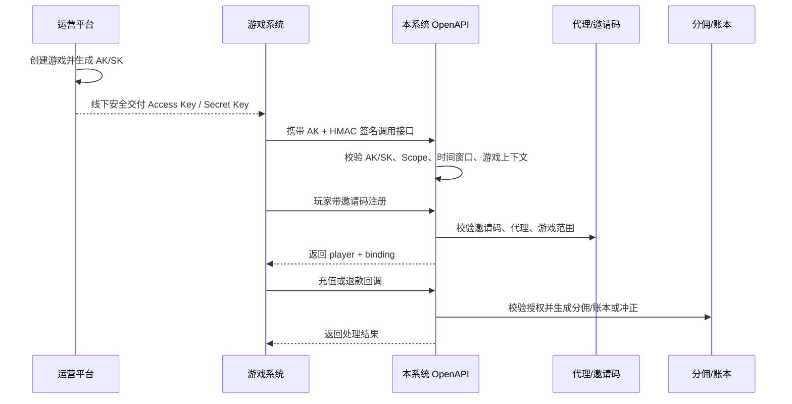

# 游戏系统对接接口文档

> 适用范围：外部游戏系统/游戏平台接入本运营后台，用于玩家创建、邀请码注册归因、代理游戏授权查询、结算规则同步、充值成功/退款回调。  
> OpenAPI 基础路径：`/openapi/game`，示例以 `{OPENAPI_BASE_URL}` 表示，例如 `https://admin.example.com/openapi/game`。后台管理接口仍位于 `/api`，不对游戏系统开放。

## 1. 对接模型

### 1.1 凭证来源

运营平台在创建游戏时自动生成该游戏专属 OpenAPI 凭证：

- `Access Key`：通过请求头传输，用于定位凭证、租户、品牌和游戏。
- `Secret Key`：仅创建或重置时展示一次，游戏平台必须保存在服务端，不能明文放到客户端或请求头。
- `Scopes`：控制该凭证可以调用的 OpenAPI 能力。

管理端可在游戏管理页面查看当前游戏的 `Access Key`、授权范围、最后使用时间，并可重置 `Secret Key`。重置后旧 `Secret Key` 立即失效。

### 1.2 业务流程



### 1.3 接口清单

| 场景 | 方法 | 路径 | Scope | 说明 |
|---|---:|---|---|---|
| 玩家创建 | POST | `/openapi/game/players` | `player:create` | 不带邀请码创建当前游戏玩家 |
| 玩家邀请码注册 | POST | `/openapi/game/players/register-with-invite` | `player:register_with_invite` | 创建当前游戏玩家并绑定代理 |
| 代理游戏授权查询 | GET | `/openapi/game/agent-game-access` | `game_access:read` | 查询当前游戏下代理授权 |
| 结算规则查询 | GET | `/openapi/game/rules` | `rule:read` | 查询当前游戏可用规则 |
| 枚举字典查询 | GET | `/openapi/game/enum-dictionaries` | 无额外 scope | 查询当前游戏对接所需枚举字典 |
| 充值/退款回调 | POST | `/openapi/game/recharge/callback` | `recharge:callback` | 推送当前游戏充值成功或退款 |

## 2. AK/SK 签名认证

游戏平台不需要登录后台账号，也不能调用后台 `/api/*` 接口。所有 `/openapi/game/*` 请求必须携带游戏凭证签名头。

### 2.1 请求头

```http
X-Game-Access-Key: ga_live_xxxxxxxxx
X-Game-Timestamp: 2026-04-24T12:30:03Z
X-Game-Nonce: nonce-unique-value
X-Game-Signature: sha256=abcdef...
Content-Type: application/json
X-Request-ID: req-optional-for-tracing
```

### 2.2 签名字符串

```text
METHOD + "\n" +
PATH + "\n" +
RAW_QUERY + "\n" +
TIMESTAMP + "\n" +
NONCE + "\n" +
SHA256_HEX(RAW_BODY)
```

说明：

- `METHOD` 使用大写 HTTP 方法，例如 `POST`、`GET`。
- `PATH` 只包含路径，例如 `/openapi/game/recharge/callback`。
- `RAW_QUERY` 使用原始 query string；没有查询参数时为空字符串。
- `RAW_BODY` 使用请求发送的原始 body 字节；GET 无 body 时按空字符串计算 SHA256。
- `TIMESTAMP` 必须与 `X-Game-Timestamp` 完全一致。
- `NONCE` 必须与 `X-Game-Nonce` 完全一致。

签名算法：

```text
X-Game-Signature = "sha256=" + HMAC_SHA256_HEX(secretKey, signString)
```

示例签名字符串：

```text
POST
/openapi/game/recharge/callback

2026-04-24T12:30:03Z
nonce-001
9f86d081884c7d659a2feaa0c55ad015...
```

### 2.3 服务端校验规则

本系统会校验：

1. `Access Key` 是否存在；
2. 凭证状态是否为 `active`；
3. 凭证是否过期；
4. `X-Game-Timestamp` 是否在 ±5 分钟窗口内；
5. HMAC 签名是否正确；
6. 当前接口所需 `scope` 是否在凭证授权范围内；
7. 当前租户、品牌、游戏上下文由 `Access Key` 绑定关系推导，调用方不能跨租户、跨品牌、跨游戏访问。

> 当前实现已校验时间窗口与签名。生产环境建议继续增加 nonce 持久化或缓存去重，用于严格防重放。

### 2.4 默认授权范围

创建游戏时默认凭证包含：

| Scope | 说明 |
|---|---|
| `player:create` | 创建当前游戏玩家 |
| `player:register_with_invite` | 当前游戏玩家通过邀请码注册绑定 |
| `game_access:read` | 查询当前游戏代理授权 |
| `rule:read` | 查询当前游戏相关规则 |
| `recharge:callback` | 当前游戏充值/退款回调 |

## 3. 通用约定

### 3.1 时间格式

时间字段使用 RFC3339 / ISO-8601 字符串，例如：

```text
2026-04-24T12:30:45Z
2026-04-24T20:30:45+08:00
```

### 3.2 列表响应

```json
{
  "items": [],
  "total": 0
}
```

### 3.3 错误响应

```json
{
  "code": "bad_request",
  "message": "playerID is required",
  "error": "playerID is required"
}
```

常见 HTTP 状态码：

| 状态码 | 说明 |
|---:|---|
| 200 | 成功或幂等重复请求成功返回 |
| 201 | 创建成功 |
| 400 | 参数错误、签名格式错误、业务校验失败 |
| 401 | 缺少 AK/SK 签名头、凭证无效、签名错误或时间窗口无效 |
| 403 | 当前凭证缺少接口所需 Scope |
| 404 | 资源不存在或不在当前游戏上下文范围内 |
| 500 | 服务端异常 |

## 4. 玩家接口

### 4.1 创建玩家

```http
POST {OPENAPI_BASE_URL}/players
```

#### 请求体

| 字段 | 类型 | 必填 | 说明 |
|---|---|---:|---|
| playerNo | string | 否 | 游戏侧玩家编号；为空时系统自动生成 |
| platformUserID | string | 是 | 游戏侧/平台侧用户唯一标识 |
| nickname | string | 否 | 昵称 |
| phone | string | 否 | 手机号 |
| countryCode | string | 否 | 国家/地区码 |
| currency | string | 否 | 币种；默认取游戏币种或 `CNY` |

> `tenantID`、`brandID`、`registerGameID` 均由 `Access Key` 绑定的游戏推导，调用方传入无效。

#### 示例请求

```json
{
  "playerNo": "PLY-10001",
  "platformUserID": "user-10001",
  "nickname": "Demo User",
  "currency": "CNY"
}
```

#### 示例响应 `201`

```json
{
  "id": 102,
  "tenantID": 1,
  "brandID": 10,
  "playerNo": "PLY-10001",
  "platformUserID": "user-10001",
  "nickname": "Demo User",
  "currency": "CNY",
  "status": "active",
  "registerGameID": 9001
}
```

### 4.2 邀请码注册并绑定代理

```http
POST {OPENAPI_BASE_URL}/players/register-with-invite
```

#### 请求体

| 字段 | 类型 | 必填 | 说明 |
|---|---|---:|---|
| playerNo | string | 否 | 游戏侧玩家编号；为空时系统自动生成 |
| platformUserID | string | 是 | 游戏侧/平台侧用户唯一标识 |
| nickname | string | 否 | 昵称 |
| phone | string | 否 | 手机号 |
| countryCode | string | 否 | 国家/地区码 |
| currency | string | 否 | 币种；默认取游戏币种或 `CNY` |
| inviteCode | string | 是 | 代理邀请码 |
| remark | string | 否 | 绑定备注 |

#### 关键规则

- 玩家租户、品牌、注册游戏由 `Access Key` 推导。
- 邀请码必须存在、启用且在有效期内。
- 邀请码所属代理必须与当前游戏处于相同租户/品牌范围。
- 如果邀请码配置了游戏范围，当前 `Access Key` 绑定的游戏必须在允许范围内。
- 当前游戏必须可代理，且代理必须拥有当前游戏授权。
- 同一个玩家重复注册时会返回已有玩家；如已绑定代理则返回已有绑定。

#### 示例请求

```json
{
  "playerNo": "PLY-IT-001",
  "platformUserID": "it-user-001",
  "nickname": "Integration User",
  "currency": "CNY",
  "inviteCode": "INV-AG001"
}
```

#### 示例响应 `201`

```json
{
  "player": {
    "id": 102,
    "tenantID": 1,
    "brandID": 10,
    "playerNo": "PLY-IT-001",
    "platformUserID": "it-user-001",
    "registerGameID": 9001,
    "status": "active"
  },
  "binding": {
    "id": 5001,
    "tenantID": 1,
    "brandID": 10,
    "playerID": 102,
    "agentID": 2001,
    "inviteCode": "INV-AG001",
    "status": "bound"
  }
}
```

## 5. 代理游戏授权查询

```http
GET {OPENAPI_BASE_URL}/agent-game-access?agentID=2001&status=enabled
```

### Query 参数

| 字段 | 类型 | 必填 | 说明 |
|---|---|---:|---|
| agentID | number | 否 | 按代理过滤 |
| status | string | 否 | 按状态过滤，例如 `enabled` |

> 查询结果强制限定为 `Access Key` 绑定的当前游戏。

### 示例响应 `200`

```json
{
  "items": [
    {
      "id": 3001,
      "tenantID": 1,
      "brandID": 10,
      "agentID": 2001,
      "gameID": 9001,
      "status": "enabled",
      "agentName": "Agent A",
      "gameCode": "demo-game",
      "gameName": "Demo Game",
      "grantedAt": "2026-04-24T12:00:00Z"
    }
  ],
  "total": 1
}
```

## 6. 结算规则查询

```http
GET {OPENAPI_BASE_URL}/rules?status=published&scope=game&agentID=2001
```

### Query 参数

| 字段 | 类型 | 必填 | 说明 |
|---|---|---:|---|
| status | string | 否 | 按规则状态过滤 |
| scope | string | 否 | 按规则范围过滤 |
| agentID | number | 否 | 查询代理专属或通用规则 |

### 数据范围

- 返回当前游戏专属规则，以及租户/品牌匹配的通用平台规则或代理规则。
- 如果传入 `agentID`，返回该代理专属规则或未指定代理的通用规则。

### 示例响应 `200`

```json
{
  "items": [
    {
      "id": 7001,
      "tenantID": 1,
      "brandID": 10,
      "gameID": 9001,
      "name": "Default Commission Rule",
      "scope": "game",
      "status": "published"
    }
  ],
  "total": 1
}
```

## 7. 充值/退款回调

```http
POST {OPENAPI_BASE_URL}/recharge/callback
```

### 请求体

| 字段 | 类型 | 必填 | 说明 |
|---|---|---:|---|
| orderNo | string | 是 | 本系统业务订单号或游戏侧稳定订单号 |
| externalOrderNo | string | 否 | 外部支付订单号 |
| playerID | number | 是 | 本系统玩家 ID |
| gameID | number | 否 | 可不传；若传入必须等于 `Access Key` 绑定的游戏 |
| amount | number | 是 | 金额，必须大于 0 |
| currency | string | 否 | 币种，默认 `CNY` |
| status | string | 是 | `paid` 或 `refunded` |
| paidAt | string | 是 | 支付成功或退款业务发生时间 |
| callbackAt | string | 否 | 回调时间；为空时取服务端当前时间 |
| channel | string | 否 | 支付渠道 |
| rechargeType | string | 否 | 充值类型；若传入，必须来自枚举字典 `recharge_type` |
| requestID | string | 否 | 游戏侧请求 ID |
| callbackSource | string | 否 | 回调来源 |
| signature | string | 否 | 业务侧原始签名留痕；OpenAPI 认证以请求头 HMAC 为准 |
| idempotencyKey | string | 否 | 幂等键；强烈建议传入 |
| activityTags | string[] | 否 | 活动标签；若传入，所有值必须来自枚举字典 `activity_tag` |
| remark | string | 否 | 备注 |

### 7.1 枚举字典约定

游戏平台如需传入 `rechargeType`、`activityTags`，应先通过枚举字典接口拉取当前允许值，不要在游戏侧硬编码。

```http
GET {OPENAPI_BASE_URL}/enum-dictionaries?codes=recharge_type,activity_tag
```

### Query 参数

| 参数 | 类型 | 必填 | 说明 |
|---|---|---:|---|
| codes | string | 否 | 逗号分隔的字典编码；为空时返回全部已开放字典 |

### 当前已开放字典

| code | 说明 |
|---|---|
| `recharge_type` | 充值类型 |
| `activity_tag` | 活动标签 |

### 示例响应 `200`

```json
{
  "items": [
    {
      "code": "recharge_type",
      "key": "enum.dictionary.recharge_type",
      "strict": true,
      "items": [
        { "value": "normal", "label": "常规充值", "labelEn": "Normal" },
        { "value": "first_deposit", "label": "首充", "labelEn": "First Deposit" },
        { "value": "vip", "label": "VIP充值", "labelEn": "VIP Recharge" }
      ]
    },
    {
      "code": "activity_tag",
      "key": "enum.dictionary.activity_tag",
      "strict": true,
      "items": [
        { "value": "campaign-a", "label": "活动A", "labelEn": "Campaign A" },
        { "value": "vip", "label": "VIP活动", "labelEn": "VIP Campaign" },
        { "value": "new-user", "label": "新用户活动", "labelEn": "New User Campaign" }
      ]
    }
  ],
  "total": 2
}
```

说明：

- 当 `strict=true` 时，业务请求里传入的值必须命中字典项。
- 后台后续若调整字典项或显示文案，游戏平台应以接口返回为准。
- 建议游戏平台在启动时拉取一次，并结合缓存定期刷新。

### 充值示例请求

```json
{
  "orderNo": "ORD-20260424-0001",
  "externalOrderNo": "PAY-99887766",
  "playerID": 102,
  "amount": 100,
  "currency": "CNY",
  "status": "paid",
  "paidAt": "2026-04-24T12:30:00Z",
  "callbackAt": "2026-04-24T12:30:03Z",
  "channel": "wechat",
  "rechargeType": "normal",
  "requestID": "req-20260424-0001",
  "callbackSource": "game",
  "idempotencyKey": "recharge:ORD-20260424-0001:paid"
}
```

### 示例响应 `201` / `200`

```json
{
  "order": {
    "id": 6001,
    "tenantID": 1,
    "brandID": 10,
    "orderNo": "ORD-20260424-0001",
    "externalOrderNo": "PAY-99887766",
    "playerID": 102,
    "gameID": 9001,
    "agentID": 2001,
    "bindingID": 5001,
    "amount": 100,
    "paidAmount": 100,
    "currency": "CNY",
    "status": "paid",
    "paidAt": "2026-04-24T12:30:00Z",
    "callbackAt": "2026-04-24T12:30:03Z",
    "channel": "wechat",
    "rechargeType": "normal",
    "idempotencyKey": "recharge:ORD-20260424-0001:paid"
  },
  "commissions": 3,
  "ledgers": 3,
  "duplicate": false,
  "frozen": false
}
```

### 退款示例请求

退款时 `status` 传 `refunded`，`orderNo` 应指向原充值订单号。若原订单不存在，会返回错误。

```json
{
  "orderNo": "ORD-20260424-0001",
  "externalOrderNo": "PAY-99887766-R",
  "playerID": 102,
  "amount": 100,
  "currency": "CNY",
  "status": "refunded",
  "paidAt": "2026-04-25T09:00:00Z",
  "callbackAt": "2026-04-25T09:00:03Z",
  "requestID": "req-20260425-refund-0001",
  "callbackSource": "payment",
  "idempotencyKey": "recharge:ORD-20260424-0001:refund"
}
```

### 幂等规则

| 判断条件 | 行为 |
|---|---|
| `idempotencyKey` 已存在 | 返回已有订单，`duplicate=true` |
| `orderNo` 已存在且 `status=paid` | 返回已有订单，`duplicate=true` |
| `orderNo` 已存在且 `status=refunded` | 对原订单执行退款冲正；重复退款可能返回 `duplicate=true` |
| `status=refunded` 且原订单不存在 | 返回 400：`recharge order not found for refund callback` |

### 关键校验

| 校验 | 失败提示 |
|---|---|
| `gameID` 与 Access Key 绑定游戏不一致 | `gameID does not match access key` |
| `orderNo` 为空 | `orderNo is required` |
| `playerID` 为空或不存在 | `playerID is required` / record not found |
| `amount <= 0` | `amount must be greater than zero` |
| `status` 非 `paid/refunded` | `only paid or refunded recharge callbacks are supported` |
| `rechargeType` 不在 `recharge_type` 字典中 | `invalid rechargeType: ...` |
| `activityTags` 含有未定义标签 | `invalid activityTags: ...` |
| 玩家、游戏、绑定租户品牌不一致 | `... scope mismatch` |
| 游戏不可代理 | `game is not agent-accessible` |
| 代理未授权该游戏 | `agent does not have access to this game` |
| `paidAt/callbackAt` 格式非法 | `invalid paidAt` / `invalid callbackAt` |

## 8. 安全与数据范围

- 游戏系统只能访问 `Access Key` 绑定游戏的数据，不能通过请求参数切换租户、品牌或游戏。
- `Secret Key` 不可再次查看，只能重置；请使用密钥管理系统或服务端环境变量保存。
- 游戏客户端、H5、App 不得直接持有 `Secret Key`；所有 OpenAPI 调用应由游戏服务端发起。
- 建议每个游戏独立配置凭证，禁止多个游戏共用同一组 AK/SK。
- 建议定期轮换 `Secret Key`，并在轮换时做好游戏服务端灰度发布。
- 建议游戏平台自行记录请求签名原文、请求体 SHA256、`X-Request-ID`，便于双方排查。

## 9. 最小联调用例

建议联调顺序：

1. 获取当前游戏 AK/SK。
2. 调用 `/openapi/game/enum-dictionaries` 拉取 `recharge_type`、`activity_tag`。
3. 完成玩家创建或邀请码归因。
4. 发起充值/退款回调，并确保 `rechargeType`、`activityTags` 使用字典值。

### 9.1 玩家注册归因

```bash
curl -X POST "{OPENAPI_BASE_URL}/players/register-with-invite" \
  -H "Content-Type: application/json" \
  -H "X-Game-Access-Key: ga_live_xxxxx" \
  -H "X-Game-Timestamp: 2026-04-24T12:30:03Z" \
  -H "X-Game-Nonce: nonce-001" \
  -H "X-Game-Signature: sha256=..." \
  -d '{
    "playerNo": "PLY-IT-001",
    "platformUserID": "it-user-001",
    "nickname": "Integration User",
    "currency": "CNY",
    "inviteCode": "INV-AG001"
  }'
```

### 9.2 查询代理游戏授权

```bash
curl "{OPENAPI_BASE_URL}/agent-game-access?agentID=2001&status=enabled" \
  -H "X-Game-Access-Key: ga_live_xxxxx" \
  -H "X-Game-Timestamp: 2026-04-24T12:30:03Z" \
  -H "X-Game-Nonce: nonce-002" \
  -H "X-Game-Signature: sha256=..."
```

### 9.3 充值成功回调

建议先调用：

```bash
curl "{OPENAPI_BASE_URL}/enum-dictionaries?codes=recharge_type,activity_tag" \
  -H "X-Game-Access-Key: ga_live_xxxxx" \
  -H "X-Game-Timestamp: 2026-04-24T12:30:03Z" \
  -H "X-Game-Nonce: nonce-002a" \
  -H "X-Game-Signature: sha256=..."
```

```bash
curl -X POST "{OPENAPI_BASE_URL}/recharge/callback" \
  -H "Content-Type: application/json" \
  -H "X-Game-Access-Key: ga_live_xxxxx" \
  -H "X-Game-Timestamp: 2026-04-24T12:30:03Z" \
  -H "X-Game-Nonce: nonce-003" \
  -H "X-Game-Signature: sha256=..." \
  -H "X-Request-ID: req-it-001" \
  -d '{
    "orderNo": "ORD-IT-001",
    "externalOrderNo": "PAY-IT-001",
    "playerID": 102,
    "amount": 100,
    "currency": "CNY",
    "status": "paid",
    "paidAt": "2026-04-24T12:30:00Z",
    "callbackAt": "2026-04-24T12:30:03Z",
    "channel": "test",
    "rechargeType": "normal",
    "requestID": "req-it-001",
    "callbackSource": "game",
    "idempotencyKey": "recharge:ORD-IT-001:paid"
  }'
```
