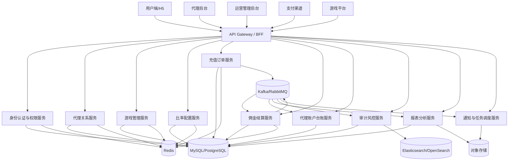
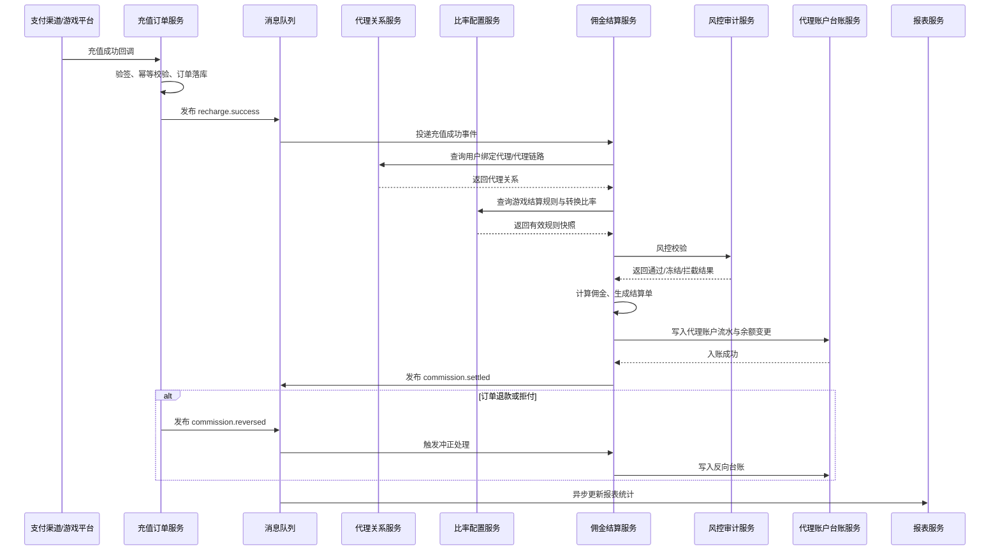
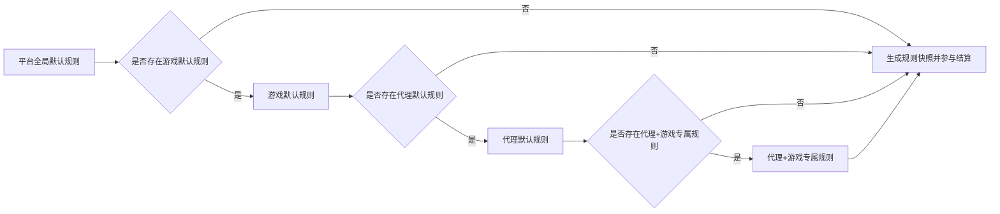

# 游戏代理管理系统框架设计方案

> 本方案面向“代理邀请用户注册、用户充值给代理分佣、代理可继续发展代理且无层级限制”的游戏业务场景，重点解决代理网络管理、游戏管理、结算比率配置、佣金结算、风控审计与可扩展运营能力。

## 1. 需求理解

当前业务具备以下核心特征：

1. 代理邀请用户注册，用户注册时绑定代理邀请码。
2. 用户后续充值时，系统根据绑定关系给代理计算佣金。
3. 代理可以继续邀请新的代理，形成无限层级代理网络。
4. 可代理的游戏需要支持新增、删除、上下架等管理。
5. 每个代理、每个游戏的结算转换比率可以单独调整。
6. 需要为未来潜在业务扩展预留能力，例如提现、活动奖励、风控稽核、分账、代理等级等。

这意味着系统不能只做简单的“邀请码绑定”，而应建设成一个围绕以下能力展开的业务平台：
- 代理网络关系管理
- 用户归属管理
- 游戏与代理授权管理
- 多维结算规则管理
- 佣金计算与台账结算
- 后台运营与审计风控

---

## 2. 系统建设目标

系统需要达成以下目标：

- 支持无限层级代理关系管理
- 支持用户注册时邀请码绑定和归属固化
- 支持按游戏、按代理维度灵活配置结算转换比率与佣金规则
- 支持充值后自动计算佣金并进入台账结算
- 支持可代理游戏的全生命周期管理
- 支持后台运营、财务、风控、审计协同工作
- 支持未来多活动、多品牌、多地区、多币种场景扩展

---

## 3. 业务边界与关键定义

为避免后续实现歧义，建议先明确以下业务定义：

### 3.1 用户归属维度

建议默认采用“全平台单一归属”的规则：
- 用户首次注册并绑定邀请码后，形成平台级代理归属。
- 该归属默认适用于用户在平台内所有游戏的充值结算。
- 如未来业务要求“按游戏独立归属”，可在绑定模型中增加 game_id 维度扩展，但第一版不建议同时支持两种模式。

### 3.2 无限层级与结算层数的区别

系统需要支持“代理关系网络无限层级”，但不代表佣金必须无限层发放。

建议区分两个概念：
- 关系层面：支持无限层级代理网络
- 结算层面：可按规则配置参与佣金结算的最大层数

即：
- 网络关系可以完整保存
- 分佣计算可限制前 N 层参与
- 统计分析可以看完整团队树
- 实际账务结算只按照规则参与层级执行

### 3.3 规则命中口径

针对同一充值事件，建议采用“逐层独立命中规则”的模式：
- 每一层代理都根据自身 + 当前游戏去匹配有效规则
- 规则优先级为：代理-游戏专属 > 代理默认 > 游戏默认 > 平台默认
- 各层规则独立计算并生成独立佣金记录

这种方式更利于：
- 审计追踪
- 差异化代理政策配置
- 冲正与重算
- 历史规则复盘

### 3.4 规则重叠冲突处理策略

如果同一代理、同一游戏、同一时间范围存在多条规则重叠，建议按以下顺序消解：

1. 优先级高者优先
2. 生效时间更晚者优先
3. 若仍冲突，以版本号更高者优先
4. 若仍冲突，配置发布失败并提示人工处理

禁止在运行时对完全冲突的多条规则进行随机命中。

---

## 4. 领域建模总览

建议将系统拆分为以下核心业务域：

1. 代理网络域
2. 用户归属域
3. 游戏管理域
4. 佣金结算域
5. 比率配置域
6. 资金台账域
7. 权限运营域
8. 风控审计域
9. 报表分析域

### 4.1 代理网络域

负责：
- 代理注册、审核、启停用
- 邀请码生成、失效、重置
- 代理邀请代理
- 上下游代理关系维护
- 团队关系查询与统计

### 4.2 用户归属域

负责：
- 用户注册时绑定邀请码
- 用户与代理归属关系固化
- 归属变更审批
- 归属历史追踪

### 4.3 游戏管理域

负责：
- 游戏新增、编辑、上下架、删除
- 游戏分类、厂商、基础属性维护
- 代理可代理游戏范围管理
- 游戏与结算规则关联

### 4.4 佣金结算域

负责：
- 充值事件接收
- 代理链路查找
- 佣金规则匹配
- 多层分润计算
- 结算单生成与重算冲正

### 4.5 比率配置域

负责：
- 平台默认比率配置
- 游戏默认比率配置
- 代理默认比率配置
- 代理-游戏专属比率配置
- 时效规则与版本管理

### 4.6 资金台账域

负责：
- 代理佣金账户
- 余额、冻结、可提现金额管理
- 收入、扣减、冲正流水记录
- 周期结算与财务对账

### 4.7 权限运营域

负责：
- 运营后台角色与权限管理
- 代理审核
- 人工调账
- 配置发布
- 报表查看与导出

### 4.8 风控审计域

负责：
- 异常邀请检测
- 作弊代理链识别
- 刷量充值识别
- 关键配置与账务变更审计

### 4.9 报表分析域

负责：
- 代理业绩报表
- 游戏收益报表
- 渠道转化报表
- 团队贡献分析
- 佣金成本分析
- 经营看板与趋势分析

---

## 5. 核心业务模块设计

### 5.1 代理管理模块

核心能力：
- 代理开户注册与审核
- 代理状态管理：待审核、启用、冻结、停用、注销
- 代理基础资料维护
- 代理标签管理
- 代理结算信息维护

设计建议：
- 代理业务实体与后台登录账号解耦
- 一个代理主体可对应多个操作账号
- 邀请码支持多码并行，但必须有主邀请码

### 5.2 代理关系网络模块

核心能力：
- 代理邀请用户
- 代理邀请代理
- 无限层级上下游关系维护
- 上级链路查询、下级树查询、团队统计
- 代理关系生效/失效管理

设计建议：
- “邀请行为”与“最终归属关系”分开建模
- 无限层级关系不要完全依赖递归实时查询
- 建议采用“邻接表 + 闭包表/祖先路径表”双模型设计

### 5.3 用户绑定模块

核心能力：
- 注册时填写邀请码
- 邀请码有效性校验
- 用户绑定代理归属
- 改绑审批与归属历史管理

关键规则：
- 用户首次注册绑定为主归属来源
- 默认不允许无痕改绑
- 若允许补绑，必须限制时间窗并保留审计记录

### 5.4 游戏管理模块

核心能力：
- 游戏新增、编辑、删除、上下架
- 游戏是否可代理配置
- 代理对游戏的可推广权限管理
- 游戏与佣金规则绑定

设计建议：
- 游戏删除采用逻辑删除
- 已产生历史交易的游戏禁止物理删除
- 区分“可见范围”和“可代理范围”两个概念
- 游戏下线后，历史订单与历史结算仍保留，既有账目继续可查、可对账

### 5.5 佣金与结算模块

核心能力：
- 用户充值事件接入
- 按用户归属找到代理链路
- 根据游戏与代理维度匹配佣金规则
- 逐层生成佣金明细
- 生成结算单、汇总单、对账单
- 支持冻结、解冻、冲正、补发、重算

设计建议：
- 充值流水是结算源事实，不允许直接改写
- 佣金结果区分“实时预估”和“最终结算”
- 结算服务支持事件重放和幂等消费
- 结算过程建议异步化

### 5.6 比率配置模块

核心能力：
- 全局默认比率
- 游戏默认比率
- 代理默认比率
- 代理-游戏专属比率
- 生效时间、失效时间、版本管理
- 配置试算与审计

推荐优先级：
代理-游戏专属 > 代理默认 > 游戏默认 > 平台默认

配置建议包括：
- 充值转结算金额转换比率
- 佣金比例
- 是否参与活动奖励
- 结算周期
- 是否允许向上/向下分润
- 最大结算参与层数

---

## 6. 关键业务流程

### 6.1 代理邀请用户注册流程

1. 代理生成或持有邀请码。
2. 用户注册时填写邀请码。
3. 系统校验邀请码有效性、代理状态、渠道/游戏限制。
4. 系统创建用户并绑定代理归属。
5. 写入归属关系表与归属历史表。
6. 记录邀请事件日志与审计日志。

关键控制点：
- 邀请码有效期
- 邀请码是否可重复使用
- 冻结代理是否允许继续拉新
- 邀请码是否按渠道、地区、游戏限制

### 6.2 代理邀请代理流程

1. 上级代理分享代理邀请码或邀请链接。
2. 被邀请人申请成为代理。
3. 审核通过后建立正式代理上下级关系。
4. 更新代理关系链快照或闭包表。
5. 刷新团队统计指标。

关键控制点：
- 禁止形成环状关系
- 审核前仅记录申请关系，审核后才写正式网络
- 历史结算需基于关系快照，不能被后续组织调整污染

### 6.3 用户充值佣金结算流程

1. 支付渠道或游戏平台通知充值成功。
2. 充值订单服务完成验签、幂等去重、订单入库。
3. 发布充值成功事件。
4. 结算服务消费事件。
5. 查询用户绑定代理与完整上游链路。
6. 查询当前游戏对应的有效结算规则。
7. 按优先级匹配代理-游戏专属规则或默认规则。
8. 逐层计算佣金明细。
9. 写入佣金明细、代理台账、汇总结算表。
10. 如命中风控，则先冻结佣金或进入人工复核。

关键控制点：
- 同一充值订单只能成功结算一次
- 支持延迟确认与冻结期
- 支持退款后的佣金冲正
- 支持规则快照固化，保证可追溯

### 6.4 周期结算流程

1. 按日/周/月汇总代理佣金。
2. 扣除冻结、冲正、处罚、税费等项目。
3. 生成周期结算单。
4. 审核通过后形成可提现金额。
5. 归档结算快照与报表。

---

## 7. 核心实体与关系设计

### 7.1 核心实体

#### Agent（代理）
- agent_id
- agent_code
- agent_type
- status
- direct_parent_agent_id
- invited_by_agent_id
- settlement_account_id
- created_at

#### AgentInviteCode（代理邀请码）
- invite_code
- agent_id
- status
- valid_from
- valid_to
- usage_limit
- channel_scope
- game_scope

#### Player（用户）
- player_id
- register_time
- register_channel
- status

#### PlayerAgentBinding（用户代理绑定）
- binding_id
- player_id
- agent_id
- bind_scope（默认 PLATFORM，可扩展 GAME）
- game_id（按游戏归属时使用，可空）
- bind_source
- bind_time
- status
- version

#### AgentRelation（代理关系）
- relation_id
- agent_id
- direct_parent_agent_id
- depth
- effective_from
- effective_to
- status

#### AgentRelationClosure（代理闭包关系，可选）
- ancestor_agent_id
- descendant_agent_id
- depth

#### Game（游戏）
- game_id
- game_code
- game_name
- vendor
- status
- settlement_status

#### AgentGameAccess（代理可代理游戏权限）
- agent_id
- game_id
- access_status
- effective_from
- effective_to

#### CommissionRule（佣金规则）
- rule_id
- rule_scope
- agent_id（可空）
- game_id（可空）
- commission_mode（fixed / differential / point / capped）
- commission_rate
- settlement_rate
- layer_limit
- rule_payload（JSON，存储分层比例、封顶值、差额配置等）
- effective_from
- effective_to
- priority
- version_no
- status

#### RuleSnapshot（规则快照）
- snapshot_id
- snapshot_scope（order / bill）
- reference_id
- agent_id
- game_id
- rule_id
- snapshot_content
- created_at

#### RechargeOrder（充值订单）
- order_id
- player_id
- game_id
- amount
- paid_amount
- pay_time
- order_status

#### CommissionRecord（佣金明细）
- record_id
- order_id
- beneficiary_agent_id
- source_player_id
- source_agent_id
- game_id
- layer_no
- base_amount
- commission_rate
- settlement_rate
- commission_amount
- status

#### AgentLedger（代理资金台账）
- ledger_id
- agent_id
- biz_type
- amount
- balance_after
- reference_id
- occurred_at

#### SettlementBill（结算单）
- bill_id
- agent_id
- period_start
- period_end
- total_commission
- frozen_amount
- adjustment_amount
- payable_amount
- bill_status

#### AuditLog（审计日志）
- log_id
- operator_id
- biz_type
- target_id
- action
- before_snapshot
- after_snapshot
- created_at

### 7.2 关系说明

- 一个代理可拥有多个邀请码。
- 一个代理可邀请多个用户。
- 一个代理可邀请多个下级代理。
- 一个用户通常只存在一个当前生效代理归属。
- 一个游戏可以关联多套结算规则。
- 一个代理针对不同游戏可以配置不同结算比率。
- 一笔充值可能拆分生成多条佣金记录。
- 一个代理可拥有多条资金流水和多个周期结算单。

---

## 8. 佣金与结算规则设计

### 8.1 规则抽象原则

佣金规则不应写死为固定层级固定比例，而应至少支持以下维度：
- 按游戏
- 按代理
- 按代理等级
- 按层级深度
- 按时间区间
- 按充值类型
- 按活动标签

### 8.2 基础公式建议

建议拆分为两层：

- 结算基数 = 充值金额 × 结算转换比率
- 佣金金额 = 结算基数 × 佣金比例

这样可以同时兼容：
- 游戏维度的结算差异
- 代理维度的佣金差异
- 后续叠加活动奖励或考核返利

### 8.3 多层代理分润模式

建议兼容以下模式：

1. 固定层级比例
   - 第1层 10%
   - 第2层 5%
   - 第3层 2%

2. 差额分润
   - 上级拿自己比例与下级比例之间的差值

3. 见点分润
   - 满足某层关系即可获得固定奖励

4. 封顶分润
   - 总佣金达到上限后停止继续分润

建议在账务实现层统一采用“逐层独立记账”，因为更利于：
- 审计
- 重算
- 冲正
- 责任追踪

### 8.4 结算状态机建议

佣金状态：
- 待计算
- 已计算
- 冻结中
- 可结算
- 已结算
- 已出账

特殊状态：
- 已冲正
- 已作废
- 风控拦截

说明：
- “已提现”建议作为后续提现子系统中的账户出款状态，不直接放入佣金明细主状态机。

### 8.5 重算与冲正设计

必须支持：
- 规则调整默认只影响未来单据
- 特殊情况下允许按批次重算
- 退款后自动生成反向佣金流水
- 冲正必须保留原记录和反向记录，禁止覆盖历史

---

## 9. 无限层级代理网络设计

### 9.1 建模建议

由于系统要求支持无限层级代理，不建议只用单表 direct_parent_agent_id + 递归查询来承载全部业务。

建议采用双模型：

#### 模型 A：邻接表
- 每个代理保存 direct_parent_agent_id
- 优点：结构简单，写入成本低
- 适合维护主数据

#### 模型 B：闭包表或祖先路径表
- 保存任意祖先到后代的路径关系与深度
- 优点：便于高频查询全部上级、全部下级、团队规模、指定深度节点
- 适合结算与统计分析

### 9.2 主要风险点

- 超深链路导致查询性能下降
- 环状关系导致死循环或错误分润
- 组织调整污染历史结算
- 过长分润链路导致佣金总和失控
- 大团队统计引发缓存频繁失效

### 9.3 控制建议

- 建立关系写入时的环检测
- 将“关系展示层级”和“实际结算参与层级”分开管理
- 历史结算基于关系快照，而不是实时关系
- 即便系统整体支持无限层，也建议对具体规则限制参与结算的最大层数
- 团队统计采用异步汇总，不做实时全树扫描

---

## 10. 权限与运营管理设计

### 10.1 后台角色建议

- 超级管理员
- 运营管理员
- 财务结算员
- 风控专员
- 代理审核员
- 只读审计员
- 代理后台用户

### 10.2 权限粒度建议

至少覆盖以下能力：
- 代理查看、创建、审核、冻结
- 游戏新增、上下架、配置
- 佣金规则查看、编辑、发布、回滚
- 结算单查看、确认、导出
- 人工调账、冲正、重算
- 报表导出
- 审计日志查看

### 10.3 关键运营能力

- 代理批量导入与批量配置
- 按代理或游戏查看收益报表
- 多维统计：代理、团队、游戏、时间、渠道
- 异常订单筛查
- 结算试算
- 配置变更审批流
- 操作留痕与版本回滚

### 10.4 审计要求

所有高风险动作应记录：
- 谁在什么时间修改了什么规则
- 修改前后差异
- 是否经过审批
- 生效时间与影响范围
- 是否已经发布

---

## 11. 技术架构设计

### 11.1 设计目标与原则

技术架构需要同时满足：
- 复杂代理关系管理
- 高频充值事件处理
- 多维规则灵活配置
- 佣金结算可追溯
- 后续可逐步演进为更强的分布式架构

推荐落地方式：
- 中早期：模块化单体 + Redis + MQ + 定时任务
- 中后期：按域逐步拆分为微服务

总体原则：
- 交易事实、规则配置、结算结果三类数据分离
- 充值主链路与结算链路解耦
- 所有关键结果可审计、可重放、可对账
- 高频查询与高频写入分别优化

### 11.2 系统分层

#### 接入层
包含：
- 管理后台 Web
- 代理后台 Web/H5
- 开放 API
- 支付/游戏平台回调入口
- API Gateway / BFF

职责：
- 登录认证
- 请求签名校验
- 限流与防刷
- 路由转发
- 审计采集

#### 应用层
包含：
- 注册绑定应用服务
- 代理关系应用服务
- 游戏管理应用服务
- 充值入账应用服务
- 佣金结算应用服务
- 报表与对账应用服务

职责：
- 用例编排
- 事务协调
- 权限控制
- 事件发布

#### 领域层
包含：
- 代理网络领域服务
- 用户归属领域服务
- 游戏规则领域服务
- 规则匹配领域服务
- 佣金计算领域服务
- 台账记账领域服务
- 结算聚合领域服务
- 风控审计领域服务

#### 基础设施层
建议组件：
- MySQL / PostgreSQL：事务数据存储
- Redis：缓存、幂等、热点关系链查询
- Kafka / RabbitMQ：充值事件、结算事件、通知事件
- Elasticsearch / OpenSearch：审计日志检索
- Object Storage：导出文件、对账文件、快照归档
- 定时任务平台：补偿、对账、汇总、重算
- Prometheus + Grafana：监控告警
- Loki / ELK：日志集中化

---

## 12. 核心服务划分建议

### 12.1 身份与权限服务
- 运营后台账号管理
- 代理账号认证
- RBAC 权限控制
- 敏感操作二次验证

### 12.2 代理关系服务
- 邀请码生成与管理
- 用户注册绑定代理
- 代理邀请代理
- 上下游链路查询
- 关系快照维护

### 12.3 游戏管理服务
- 游戏基础信息维护
- 游戏上下架
- 可代理游戏范围管理
- 游戏结算参数维护

### 12.4 比率配置服务
- 代理/游戏规则配置
- 默认规则与专属规则管理
- 生效时间与版本管理
- 规则快照发布

### 12.5 充值订单服务
- 接收充值成功回调
- 验签与幂等
- 充值订单入库
- 发布充值成功事件

### 12.6 佣金结算服务
- 消费充值成功事件
- 查询代理链与规则快照
- 生成佣金明细和结算单
- 失败补偿、重试、重算
- 支持人工触发重算接口

### 12.7 代理账户与台账服务
- 账户余额管理
- 收入、冻结、解冻、扣减、冲正流水
- 周期结算汇总

### 12.8 审计与风控服务
- 异常充值监控
- 异常代理关系识别
- 高风险操作留痕
- 黑名单与限额控制

### 12.9 报表与分析服务
- 代理业绩统计
- 游戏收益统计
- 佣金成本统计
- 渠道转化分析

---

## 13. 数据库、缓存与消息队列建议

### 13.1 数据库建议

推荐使用 MySQL 8.x 或 PostgreSQL。

建议核心表：
- agent
- agent_invite_code
- user_account
- user_agent_binding
- agent_relation
- agent_relation_closure
- game
- agent_game_scope
- settlement_rule
- rule_snapshot
- recharge_order
- recharge_callback_log
- commission_settlement
- commission_detail
- agent_account
- agent_account_ledger
- operation_audit_log
- reconciliation_task
- reconciliation_result

### 13.2 缓存建议

推荐使用 Redis，缓存如下内容：
- 邀请码 -> 代理映射
- 热门游戏配置
- 代理 + 游戏比率规则
- 代理关系链快照
- 后台权限缓存
- 幂等 Key / 回调去重 Key

注意：
- 配置变更后需主动失效缓存
- 高一致性以数据库为准
- 账务结果必须落库，不能只存缓存

### 13.3 消息队列建议

推荐 Kafka 或 RabbitMQ。

建议主题/队列：
- recharge.success
- commission.calculate
- commission.settled
- commission.reversed
- account.ledger.changed
- rule.changed
- audit.event
- reconciliation.requested

适用场景：
- 充值后异步结算
- 台账变动通知
- 报表异步汇总
- 异常补偿与重算

---

## 14. 关键接口设计建议

### 14.1 代理与邀请相关接口
- POST /api/agent/invite-code/create
- GET /api/agent/invite-code/list
- POST /api/user/register-with-invite
- POST /api/agent/register-with-invite
- GET /api/agent/{id}/relation-tree
- GET /api/agent/{id}/downlines
- GET /api/agent/{id}/uplines

### 14.2 游戏管理接口
- POST /api/game/create
- POST /api/game/update
- POST /api/game/enable
- POST /api/game/disable
- POST /api/agent-game/bind
- POST /api/agent-game/unbind
- GET /api/agent/{id}/games

### 14.3 规则配置接口
- POST /api/settlement-rule/create
- POST /api/settlement-rule/update
- POST /api/settlement-rule/publish
- GET /api/settlement-rule/query
- GET /api/settlement-rule/effective-snapshot

### 14.4 充值与结算接口
- POST /api/recharge/callback
- POST /api/recharge/manual-import
- GET /api/recharge/order/{orderNo}
- POST /api/commission/recalculate
- GET /api/commission/settlement/{id}
- GET /api/agent/{id}/commission-details
- GET /api/agent/{id}/account-ledger

### 14.5 审计与报表接口
- GET /api/audit/logs
- GET /api/report/agent-performance
- GET /api/report/game-settlement
- POST /api/reconciliation/run

---

## 15. 核心异步流程设计

### 15.1 注册绑定流程

1. 用户输入邀请码注册。
2. 注册服务校验邀请码有效性。
3. 查询邀请码所属代理。
4. 创建用户账户。
5. 写入用户-代理绑定关系。
6. 固化绑定快照。
7. 写入审计日志并发布绑定事件。

### 15.2 充值佣金结算流程

1. 支付渠道/游戏平台回调充值成功。
2. 充值订单服务完成验签、幂等校验、订单落库。
3. 发布 recharge.success 事件。
4. 佣金结算服务消费事件。
5. 查询用户绑定代理关系和上游链路。
6. 查询游戏与代理对应的有效规则快照。
7. 计算佣金、生成结算单与明细。
8. 写入代理账户台账。
9. 发布 commission.settled 事件。
10. 报表服务异步更新统计结果。

### 15.3 一致性与补偿策略

建议采用“本地事务 + 可靠消息 + 幂等消费”的组合策略：

- 充值订单入库与 recharge.success 事件发布保持事务一致性
- 佣金结算服务对 order_id 做全局幂等控制
- 台账入账失败时进入补偿任务队列
- 补偿任务只做追加修复，不直接覆盖历史记录
- 所有重算操作必须生成新的修正记录并关联原始记录

---

## 16. 架构图

### 16.1 系统组件架构图

### 16.2 充值结算时序图

### 16.3 规则匹配优先级图

---

## 17. 可用性、扩展性与部署建议

### 17.1 可用性建议

- 充值订单与佣金结算解耦，避免充值入口被阻塞
- 关键异步消息支持重试、死信队列、幂等消费
- 数据库主从分离或高可用部署
- 关键大表按时间或业务维度分表/分区
- 规则读取优先走缓存，但写入必须落库
- 充值、结算、台账三类数据必须支持对账

### 17.2 扩展性建议

未来可扩展：
- 代理等级体系
- 提现审核与打款
- 多币种、多区域运营
- 活动奖励与任务返利
- 游戏厂商分账
- 多品牌/多租户模式
- 实时数据看板
- 智能风控模型

建议预留扩展点：
- 规则引擎接口
- 统一事件总线标准
- 配置版本与规则快照机制
- 多租户隔离字段

### 17.3 部署建议

中小规模：
- 模块化单体应用 + 独立 MySQL/Redis/MQ

中大型规模：
- agent-service
- game-service
- rule-service
- recharge-service
- settlement-service
- account-service
- audit-service
- report-service

生产建议：
- API Gateway 多实例
- 核心服务多实例
- Redis 高可用
- MQ 集群化部署
- 数据库高可用
- 独立日志、监控、告警系统

### 17.4 安全与审计建议

- 后台接口使用 RBAC + 数据权限控制
- 关键配置操作走审批流或二次确认
- 外部回调必须验签
- 敏感字段脱敏展示
- 审计日志必须可追溯、不可篡改
- 定期执行数据库备份与恢复演练

---

## 18. 潜在业务扩展方向

1. 代理等级与团队考核体系
2. 首充奖、拉新奖、团队达标奖等活动奖励体系
3. 多币种、多钱包、多国家地区支持
4. 财务提现、税务、发票与对账系统对接
5. 多品牌游戏平台统一代理中台
6. 数据中台与实时报表看板
7. 风控规则引擎与智能识别模型

---

## 19. 分阶段落地建议

### 第一阶段：最小可用版本
- 代理管理
- 邀请码注册绑定
- 游戏管理
- 基础充值订单接入
- 规则快照机制
- 有限结算层数的佣金结算
- 基础台账
- 后台权限与审计

说明：
- 第一阶段虽然只实现“有限结算层数”，但底层代理关系模型应直接按“无限层级关系”设计，避免后续推翻重构。

### 第二阶段：增强版
- 无限层代理关系查询优化
- 闭包表/路径表
- 多规则优先级与复杂分润模式
- 周期结算单
- 报表与风控
- 冲正、补单、重算

### 第三阶段：平台化
- 多租户/多品牌
- 活动奖励中心
- 提现财务系统
- 数据中台
- 智能风控

---

## 20. 结论

该系统本质上不是一个简单的邀请码分佣功能，而是一个以“代理关系网络 + 用户归属 + 游戏维度规则 + 佣金结算 + 资金台账 + 运营审计”为核心的复合型业务平台。

真正的设计重点不是单纯支持“无限层级”，而是在无限关系网络下仍然能够做到：
- 佣金计算可控
- 账务结果可追溯
- 规则调整可演进
- 运营配置可审计
- 系统性能可扩展

因此，推荐采用“分层架构 + 领域解耦 + 事件驱动结算 + 规则快照 + 台账记账”的总体设计方案。
